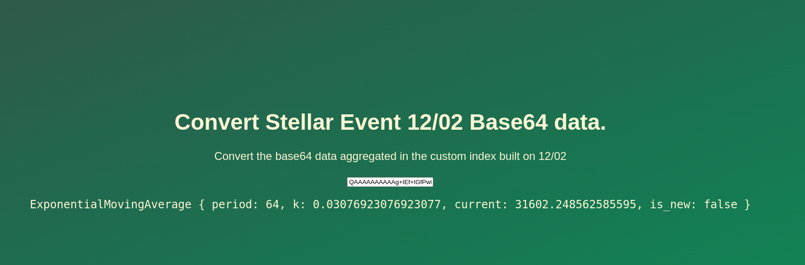

# Working with Data on Stellar, the Role of Indexers and Live-Coding a ZephyrVM Program

This is the result of the second part of the "Working with Data on Stellar, the Role of Indexers and Live-Coding a ZephyrVM Program" event,
wehere [@heytdep](https://github.com/heytdep) live-coded a ZephyrVM program to track and aggregate the difference between the average transaction
fee in soroban.

This specific implementation uses an exponential moving average to track the average fees with a period of 64 ledgers. 

# Try it Out!

The index resulting from this program is of public domain and can be used by anyone without requiring any API keys.

You can very simply head to https://api.mercurydata.app:2083/graphiql and paste the following query:


```graphql
query Stats {
  allZephyrE7Ce31Cda4D6F11665F9847F317D6186S {
    edges {
      node {
        classic
        contracts
        other
        feeSor
        feeClas
      }
    }
  }
}
```

Example result:

```json
{
  "data": {
    "allZephyrE7Ce31Cda4D6F11665F9847F317D6186S": {
      "edges": [
        {
          "node": {
            "classic": "AAAAAOAEAAAAAAAAAAAAAAAAAAA=",
            "contracts": "AAAAAAwAAAAAAAAAAAAAAAAAAAA=",
            "other": "AAAAAAAAAAAAAAAAAAAAAAAAAAA=",
            "feeSor": "QAAAAAAAAAAg+IEf+IGfPwkMc+iP3N5AAA==",
            "feeClas": "QAAAAAAAAAAg+IEf+IGfPyuvF5pPp2hAAA=="
          }
        }
      ]
    }
  }
}
```

At the current stage of Zephyr, the data stored in the index needs to be deserialized, and to smoothen things up we've built a 
very simple app to do so. You can head over to https://working-with-data-on-stellar-event-zephyr.pages.dev/ and paste in the field the base64 data, for example:



In the above image you can see that the average txfee for Soroban-related operations is `~31602` stroops. Note that this has been running from ledger `101903`.
